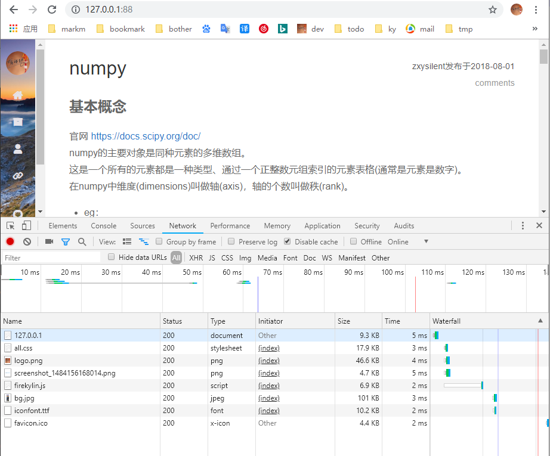
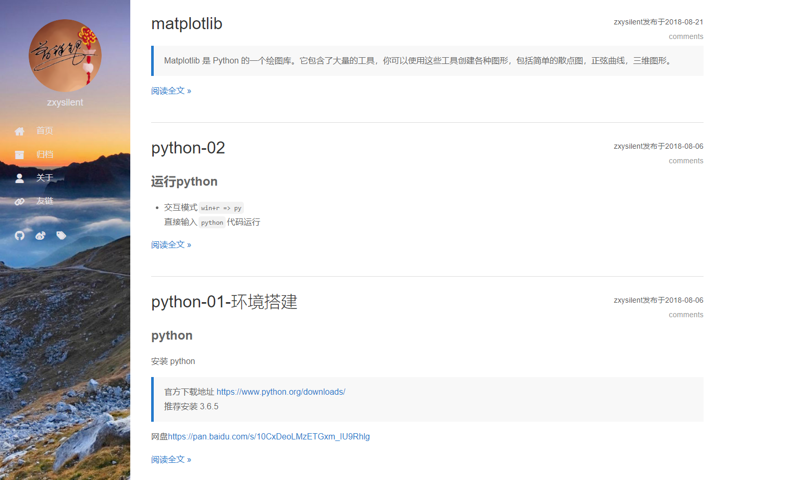
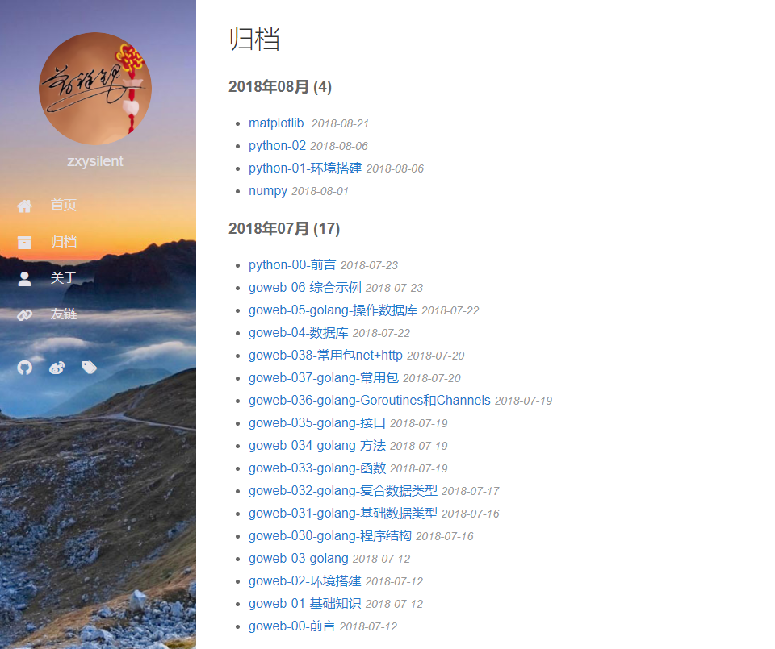
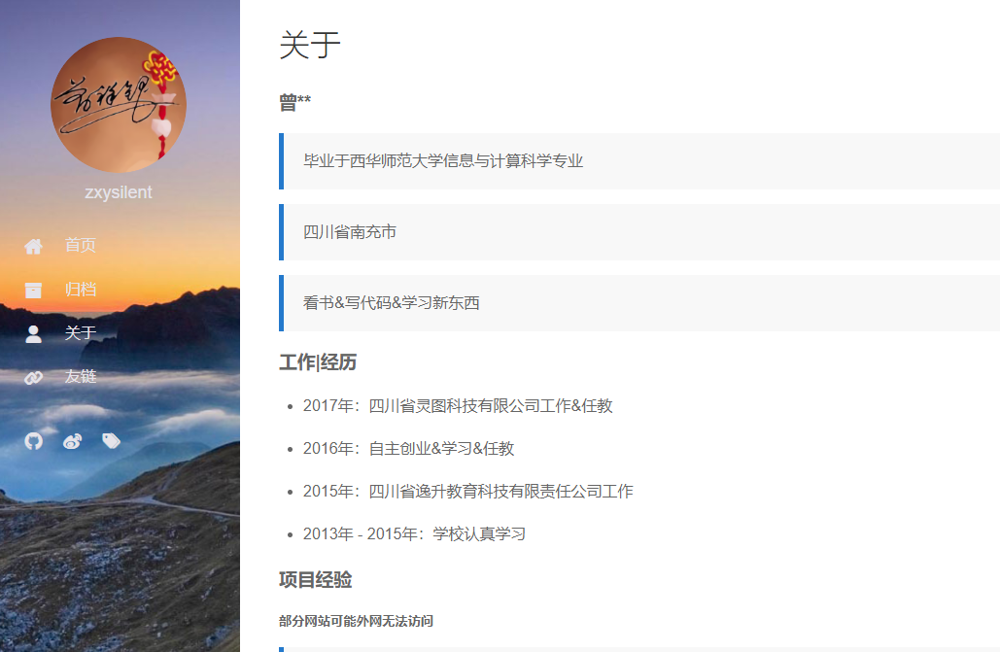
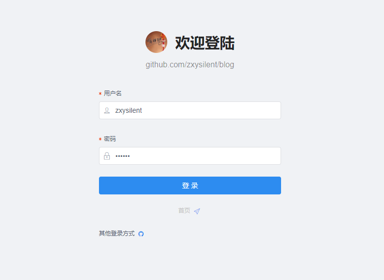
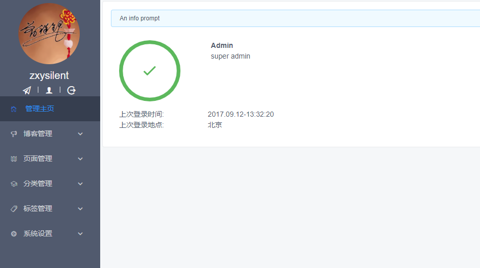
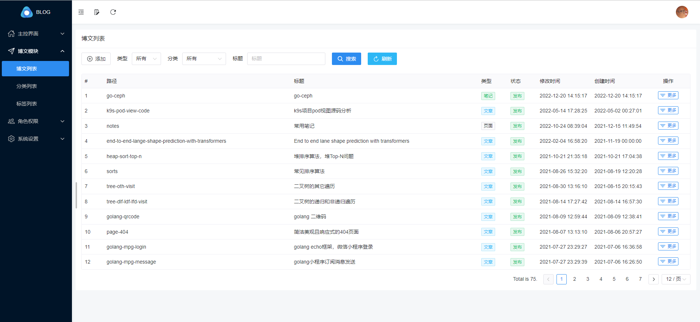
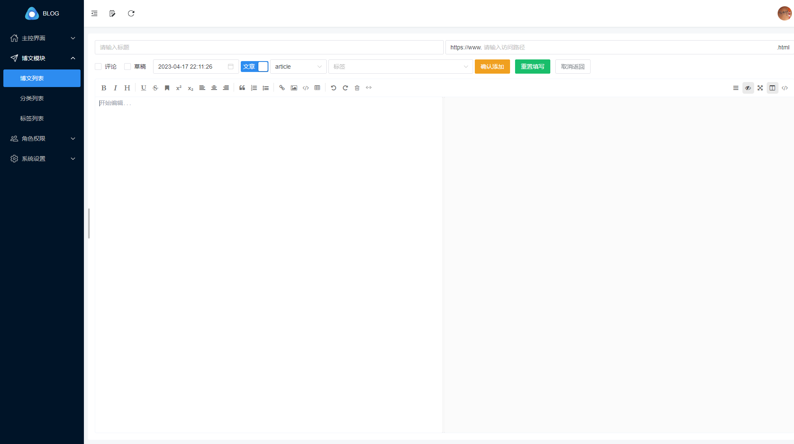
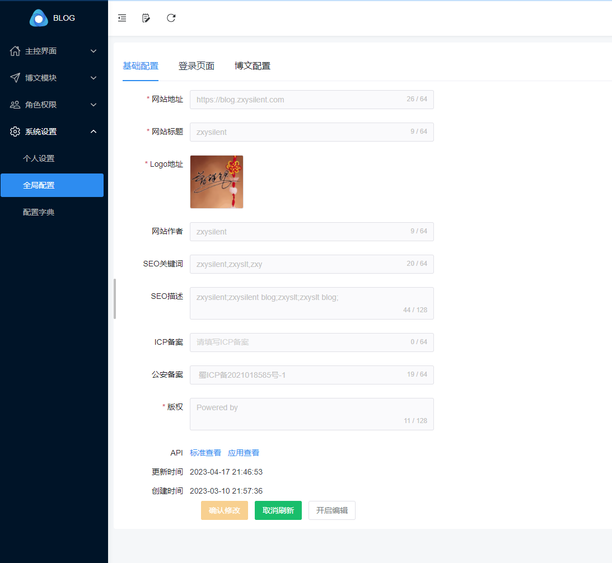

### 一个 go语言实现的博客 
#### 技术栈
- golang
- vue
- echo 框架
- 前台界面目前修改于 https://firekylin.org/

### 预览地址

[https://blog.zxysilent.com/](https://blog.zxysilent.com/)

### 开发原因 
- 现在自己使用博客系统不方便管理、部署和二次开发
- 渲染速度到不到想要的效果

### 计划功能
实现```blog```功能和基本```cms```功能,提取快速开发框架和通用后台管理界面
- [x] 文章管理
- [x] 页面管理
- [x] 分类管理
- [x] 标签管理
- [x] 系统设置
- [x] 管理主页

### tips

- 替换markdown 编辑器为富文本编辑器即可作为`CMS`  
[https://github.com/zxysilent/view-design-admin](https://github.com/zxysilent/view-design-admin)

- 富文本预览地址  
[http://76.zxysilent.com/demos/view-design-admin/index.html#/pages/editor](http://76.zxysilent.com/demos/view-design-admin/index.html#/pages/editor)

### 讨论群
🐧🐧 1059282178

### 使用方式
```
git clone https://github.com/zxysilent/blog.git
```
若要部署，请修改关键信息[jwt、用户名、密码等]
数据库自带文章内容请在部署前删除

####  运行服务
- 配置```conf.toml```数据库信息
- 还原 ```data```目录下 ```db.sql``` 数据库
数据库自带文章内容请在部署前删除
- 安装依赖
- 安装 swag   
    ```go get -u github.com/swaggo/swag/cmd/swag```
- 运行```swag init ```生成api文档
- 运行后台 ```go run```  

####  运行后台
- 安装依赖 ``` npm install ```
- 开发运行 ``` npm run serve ```
- 浏览器打开 [http://127.0.0.1:8080/](http://127.0.0.1:8080/)
- 发布 ```npm run build ``` 会自动发布到 ```dist```目录下面
- 友链里面第一个为后台登陆地址默认用户名```zxysilent```,密码```zxyslt```，可自行数据库修改
### 评论配置
- 配置项目 opts(表).comment(值) 
- 配置说明 [https://github.com/gitalk/gitalk](https://github.com/gitalk/gitalk)
## 渲染性能


## 效果展示

### 前台




### 后台





## Donation
If this project help you a lot, you can support us by:

AliPay


Wechat Pay

